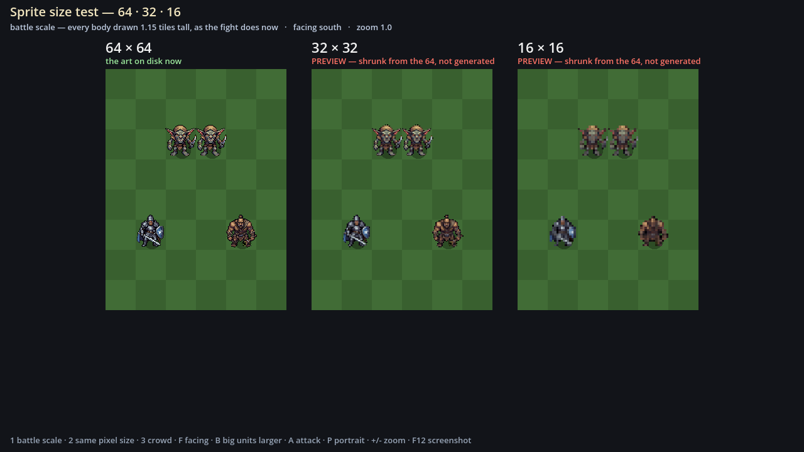
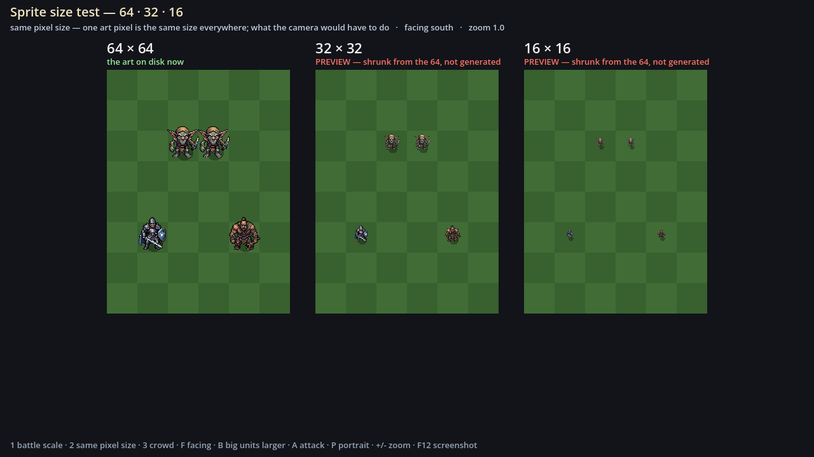
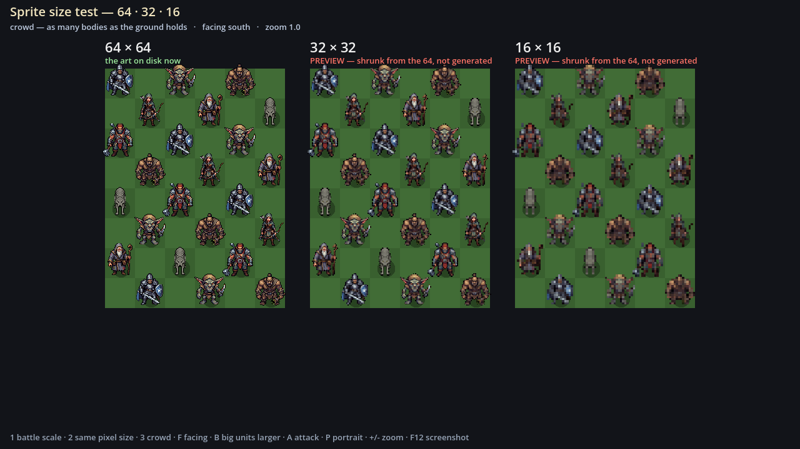
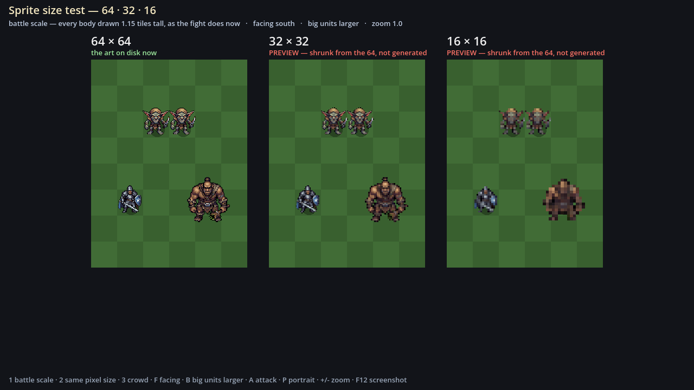

# 20 — The PixelLab size test: instructions

For whoever is spending this month's last PixelLab credits. Everything needed is on this page. The
reasons behind it are in [19 — Asset list, Tier 0](19-asset-list.md#tier-0--the-size-test-now-before-2026-09-27).

## In one paragraph

We can't generate the game's art until we choose a sprite size: **64, 32 or 16 pixels**. Everything
on disk now is 64. _Dungeon Settlers_, the game we're modelling the fight on, draws its people at
roughly **32** ([investigation/07](investigation/07-dungeon-settlers-combat.md#13-sprite-size-and-frame-counts)).
**The credits reset on 2026-09-27, and about 15% of this month is left.** It goes on generating the
same three characters at the smaller sizes, so both of us can see them side by side in the game and
choose. Anything generated at the wrong size would have to be thrown away, so nothing else is made
until this is decided.

## What you need

- The PixelLab account.
- **Optional:** the repo and Godot 4.7.2, if you want to look at the results yourself. If you don't
  have them, send the downloads to Will and he'll import them (step 4).

## 1. Settings: keep these the same for everything

The 64s on disk were all made with these settings (each unit's `art/units/<id>/metadata.json` says
so). Change only the size, so the only thing that differs between sizes is the size.

| Setting | Use |
| --- | --- |
| View | **low top-down** |
| Directions | **8**. If you're short of credits, **4** (north, south, east, west) is enough: the battle only uses those four |
| Template | **mannequin** |
| Size | what the row below says |
| Description | the prompt below, **copied exactly** |

## 2. Generate, in this order

The list is in priority order. **If the credits run out partway, stop — whatever is done is the most
useful part.** After each one, write down the credit % before and after in the **Cost** column. The
next month's art budget is planned from those numbers.

| # | Character | Size | Save the download as | Cost (% before → after) |
| --- | --- | --- | --- | --- |
| 1 | Bram, the Sworn Blade | **32 × 32** | `sizetest_32_sworn_blade.zip` | |
| 2 | Goblin | **32 × 32** | `sizetest_32_goblin.zip` | |
| 3 | Ogre | **32 × 32** | `sizetest_32_club_ogre.zip` | |
| 4 | Bram, the Sworn Blade | **16 × 16** | `sizetest_16_sworn_blade.zip` | |
| 5 | Goblin | **16 × 16** | `sizetest_16_goblin.zip` | |
| 6 | Bram's **attack** — see below | 32 (or 64 if the 32 looked wrong) | `sizetest_32_sworn_blade_attack.zip` | |
| 7 | Bram's **portrait** — see below | as big as PixelLab allows | `sizetest_portrait_sworn_blade.png` | |

**The prompts** — paste these as they are:

Bram, the Sworn Blade (`sworn_blade`):

```text
Sworn Blade — a scarred oath-sworn swordsman in dark riveted mail over a blue-grey surcoat, cropped beard, plain arming sword and small kite shield, no helmet
```

Goblin (`goblin`):

```text
Goblin — a small hunched green-grey creature in scavenged sackcloth, oversized ears, rusted crooked knife, sharp teeth
```

Ogre (`club_ogre`):

```text
Ogre — a hulking brown-skinned brute in a hide loincloth and rope harness, uprooted tree club, small eyes, heavy sloped shoulders
```

**6 — the attack.** Use PixelLab's animation tool on the 32 Bram from row 1. Describe the move as:

```text
a single overhead sword slash, stepping in, shield held close, then back to guard
```

Write down **how many frames it made** as well as the cost. Every unit needs an attack animation
in the real-time fight, so frames per attack, multiplied by the number of units, is most of the art
budget.

**7 — the portrait.** Only if PixelLab does portraits well. _Dungeon Settlers_ pairs tiny bodies
with big hand-drawn faces, and that pairing is worth testing:

```text
Portrait of Bram, the Sworn Blade: a scarred oath-sworn swordsman, cropped beard, weary eyes, dark riveted mail over a blue-grey surcoat. Head and shoulders, three-quarter view, dark fantasy, muted palette, plain dark background
```

**Don't** generate the ogre at 16, or anything not on this list. Keep the zips exactly as they
download: no unzipping or renaming the files inside.

## 3. Hand it over

Put every zip and the portrait in one folder, with this page's cost table filled in. Send it to
Will, or carry on with step 4 yourself.

## 4. Put them in the game (whoever has the repo)

From the repo folder, in PowerShell, once per zip:

```powershell
.\ek.ps1 sizetest import C:\Downloads\sizetest_32_sworn_blade.zip sworn_blade 32
.\ek.ps1 sizetest import C:\Downloads\sizetest_32_goblin.zip goblin 32
.\ek.ps1 sizetest import C:\Downloads\sizetest_32_club_ogre.zip club_ogre 32
.\ek.ps1 sizetest import C:\Downloads\sizetest_16_sworn_blade.zip sworn_blade 16
.\ek.ps1 sizetest import C:\Downloads\sizetest_16_goblin.zip goblin 16
.\ek.ps1 sizetest import C:\Downloads\sizetest_32_sworn_blade_attack.zip sworn_blade 32 attack
```

- **The portrait** is a single image. Copy it to `art/size_test/portrait/sworn_blade.png`.
- **What the import does.** Each import lists every file it placed. The folder layout is
  `art/size_test/<size>/<unit>/<state>/<facing>.png`, with animation frames under
  `<state>/<facing>/`. It also keeps the prompt, in `metadata.json`.
- **If it says "skipped" for images you expected**, PixelLab named them differently from last
  time. Copy them into that layout by hand. The viewer only cares about the layout.
- **To check what's there:**

  ```powershell
  .\ek.ps1 sizetest check
  ```

  It lists every size and character as `ready`, `PREVIEW only` or `missing`.
- **If it says Godot was not found**, tell it where Godot is, for this window only:

  ```powershell
  $env:EK_GODOT = "C:\path\to\Godot_v4.7.2-stable_win64_console.exe"
  ```

## 5. Look at them — both of us

```powershell
.\ek.ps1 sizetest
```

The viewer shows three patches of battle ground: **64 | 32 | 16**. Each has the same four bodies on
it (Bram, two goblins and an ogre), drawn the way the battle draws them. A size nobody has
generated yet is a **PREVIEW**: the 64 shrunk by the computer, labelled in red. It shows the
layout, not what PixelLab would really draw, so don't judge the art from a red label.

| Key | Shows | Ask yourselves |
| --- | --- | --- |
| **1** | Battle scale — every body 1.15 tiles tall, as the fight draws them now | At the same height, do 32 and 16 look better or worse than 64? Can you tell Bram from a goblin at a glance? |
| **2** | Same pixel size — one art pixel is the same size everywhere | The camera would sit this far back to keep pixels crisp at each size. How much more of the fight would fit on screen? |
| **3** | Crowd — as many bodies as the ground holds | Real time means more people fighting at once. Which size still reads when it's busy? |
| **F** | Turns everyone through south, east, north and west | Can you tell which way each one is facing? Side and back hits count for more, so facing has to read |
| **B** | Draws the ogre larger | Every body is drawn the same height now, so an ogre is as tall as a goblin. Should big things be big? |
| **A** | Plays Bram's attack, if it was made | Does the swing read at this size and speed? |
| **P** | Bram's portrait, if it was made | Does a big face make a small body matter more? |
| **+ / −**, wheel | Zoom | |
| **F12** | Screenshot, saved to `art/size_test/shots/` | Send screenshots to each other |

Today's view, with only the 64s generated and everything else a preview:






## 6. Decide, and write it down

1. Fill in [`art/size_test/RESULTS.md`](../art/size_test/RESULTS.md): the costs, the frame count,
   and which size each of you would pick and why.
2. Write the decision into [06 — Decisions](06-decisions.md) as the next D-number. A starting draft:

   > **D43 — Units are drawn at \_\_ × \_\_.** Every body from Tier 1 on is generated at that size,
   > same view, template and prompt. Big units are drawn \_\_. Portraits \_\_.
   > _Why:_ the size test (docs/20): \_\_.

3. Mark agenda item 9 answered in [answers.md](worldbuilding/answers.md#what-is-still-to-decide), and
   tick M10's size-test items in the [roadmap](05-roadmap.md).

After that, Tier 1 of [19](19-asset-list.md) can be generated at the chosen size once the credits
reset.
